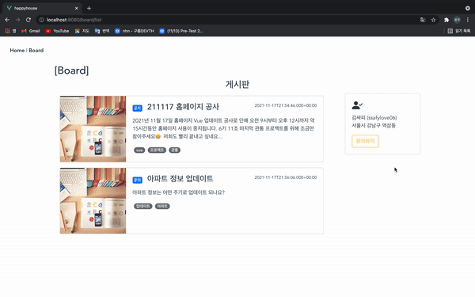
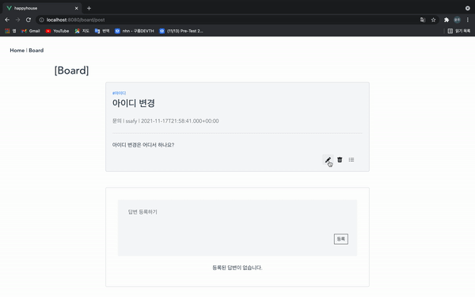
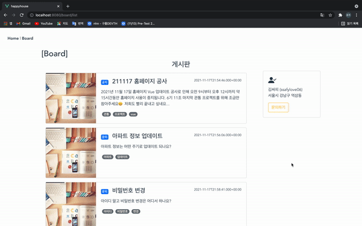
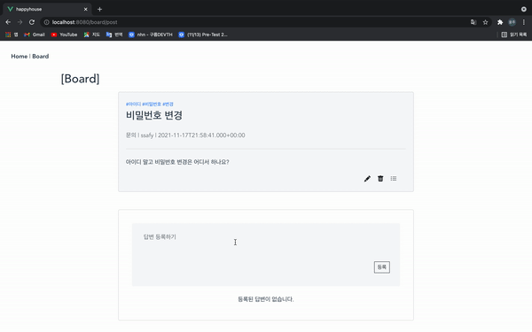
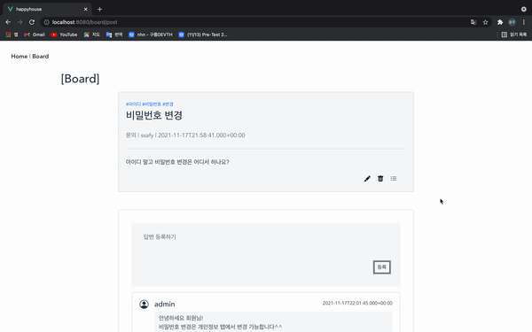
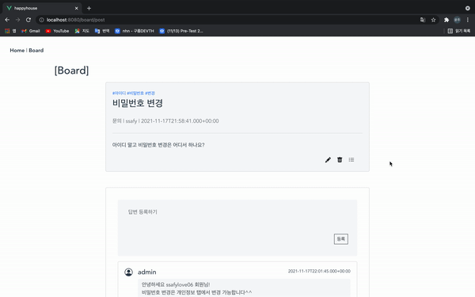

# SSAFY 6차 Vue 관통 프로젝트 - Happy House 🏘

 

## 🤓 프로젝트 참여자

- 배문규
- 김도현
- 하윤주

## 📌 목차

1. 프로젝트 소개
2. 기능 및 페이지 소개
    - QnA 게시판 추가
    - 게시글 목록 및 등록
    - 게시글 상세 조회, 수정, 삭제
    - 게시글 답변 조회
    - 게시글 답변 등록, 수정, 삭제

 

## 💡 1. 프로젝트 소개

Happy House 프로젝트의 QnA 게시판을 Vue를 활용하여 SPA 구조로 설계하고 구현합니다.

## 💡 2. 활용 데이터 및 API 소개

1. 활용 데이터

- 공공데이터 포털(https://www.data.go.kr) - 국토교통부\_아파트매매 실거래 상세 자료

웹 사이트 상에서 법정동을 입력하면 공공데이터 포털과 비동기 통신을 통해 2021년 10월 아파트매매 실거래 데이터를 받아옵니다. REST 방식으로 통신하고 XML형태의 데이터로 받아와 JSON 형태로 파싱합니다.

받은 실거래 데이터 중 핵심 정보를 리스트 형태로 출력하고, 각 아파트의 위치를 지도 상에 표현합니다.

1. 활용 API

- 카카오맵 API(https://apis.map.kakao.com/web/)

공공데이터 포털에서 받은 실거래 데이터 중 주택의 위치 좌표(위도, 경도)를 파싱하여 카카오맵에 마커로 표현합니다.

또한 실거래 데이터 리스트의 각 아파트를 선택하면 지도 상에서 상세 정보를 추가적으로 확인할 수 있습니다.

## 💡 3. 활용한 BackEnd & FrontEnd 프레임워크 소개

> BackEnd

- BackEnd는 Spring Boot 환경으로 구축하였습니다. Spring MVC 패턴을 이용하여 모델, 컨트롤러, 뷰의 각 기능 별 역할을 분리하였습니다.
- Front와 REST 방식으로 통신하여 데이터만을 전달합니다.
- MyBatis 프레임워크를 사용하여 객체와 SQL을 매핑합니다.
- Global Exception Advice를 통해 예외를 전역에서 처리합니다.

> FrontEnd

- 화면은 정적 리소스(HTML, CSS, JS)만을 사용합니다.
- Vue.js 프레임워크를 이용하여 Vue-Cli환경으로 구축하였습니다.
- axios를 통해 Back과 비동기 통신하여 데이터를 받아옵니다.
- 댓글 수정 부분에서 vuex를 활용하여 부모, 자식 컴포넌트 간 데이터 이동을 가능하게 했습니다.
- CSS는 Bootstrap-vue 테마를 적용했습니다.

## 💡 4. 기능 및 페이지 소개

### QnA 게시판, 게시글 목록 조회

- 등록된 QnA 게시글을 보여주는 게시판입니다.
- 게시글을 선택하여 게시글의 상세 내용을 확인할 수 있습니다.
- 새로운 게시글을 등록하고 게시글의 내용을 수정할 수 있으며 등록된 게시글을 삭제할 수 있습니다.
- 게시글을 선택하여 게시글에 대한 답변들을 확인할 수 있습니다.
- 새로운 답변을 등록하고 답변의 내용을 수정할 수 있으며 등록된 답변을 삭제할 수 있습니다.

 

### 게시글 등록, 상세 조회

- 게시판 우측의 버튼을 통해 게시글을 등록할 수 있습니다.
- 게시글 목록 중 게시글을 선택하여 상세 조회할 수 있습니다.

 

### 게시글 수정

- 게시글의 내용을 수정할 수 있습니다.

 

### 게시글 삭제

- 게시글을 삭제할 수 있습니다.

 

### 게시글 답변 등록, 상세 조회

- 게시글에 답변을 달 수 있습니다.
- 게시글을 상세 조회하여 게시글에 달린 답변들을 확인할 수 있습니다.

 

### 게시글 답변 수정

- 답변의 내용을 수정할 수 있습니다.

 

### 게시글 답변 삭제

- 답변을 삭제할 수 있습니다.

 

