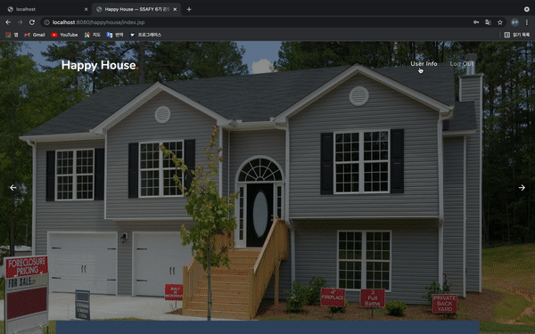
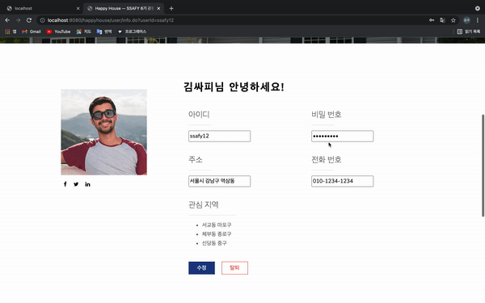

# SSAFY 4차 BackEnd 관통 프로젝트 - Happy House 🏘

 

## 🤓 프로젝트 참여자

- 배문규
- 하윤주

## 📌 목차

1. 프로젝트 소개
2. 기능 및 페이지 소개
    - 아파트 실거래가 정보 동별 조회
    - 아파트 실거래가 아파트별 조회
    - 회원 가입
    - 로그인, 로그아웃
    - 회원 정보 조회 및 수정

 

## 💡 1. 프로젝트 소개

Happy House는 서울시의 부동산 거래 정보를 한 눈에 확인할 수 있는 프로그램입니다. 아파트 및 주택의 세부 정보와 함께 거래 금액과 거래 종류를 확인할 수 있고, 또한 법정동과 아파트 명으로 특정 부동산 정보를 검색할 수도 있습니다. 회원 정보 기능을 추가하여 회원별 관심지역을 확인할 수 있습니다.

## 💡 2. 기능 및 페이지 소개

### 아파트 실거래가 정보 동별 조회

- 아파트 지역(시, 도, 구군, 동) 정보를 선택하면 해당 지역에 존재하는 아파트 정보를 보여줍니다.
- 아파트 정보는 지도 상에 마커로 출력됩니다.
- 지도 API는 카카오맵 API를 활용하였습니다.

 

### 아파트 실거래가 아파트별 조회

- 아파트 지역(시, 도, 구군, 동) 정보를 선택하고 특정 아파트 명을 검색할 경우 특정 아파트 정보를 보여줍니다.
- 아파트 이름에 검색어가 포함된 모든 아파트 정보를 출력합니다.
  

 

### 회원 가입
  
- 회원 정보를 입력하여 서버에 회원 정보를 등록할 수 있습니다.
- 회원 가입과 동시에 로그인 상태로 유지되는 자동 로그인이 지원됩니다.

 

### 로그인
- 사용자 아이디와 비밀번호를 입력하여 로그인할 수 있습니다.
- 로그인 정보인 사용자 아이디와 사용자 고유번호를 세션으로 유지합니다.

 

### 로그아웃
- 사용자 기능을 모두 사용했다면 로그아웃을 통해 세션을 종료할 수 있습니다.

 

### 회원 정보 및 관심 지역 조회

- 로그인 상태라면 회원 정보 조회 탭을 눌러 회원 정보를 확인할 수 있습니다.
- 사용자 아이디, 이름, 비밀번호, 전화번호, 주소를 확인할 수 있습니다.
- 로그인 상태의 사용자가 관심 지역을 등록하면 이를 저장하여 확인할 수 있습니다.
- 회원 정보 조회 페이지에서 회원 정보와 함께 회원이 등록한 관심 지역을 확인할 수 있습니다.

 

### 회원 정보 수정

- 회원 정보 조회 페이지에서 회원 정보를 변경할 수 있습니다.

 

### 회원 정보 삭제
- 회원 정보 조회 페이지에서 회원 정보를 삭제하고 탈퇴할 수 있습니다.
- 회원 탈퇴 시 서버에 저장된 회원 정보도 삭제됩니다.

 
