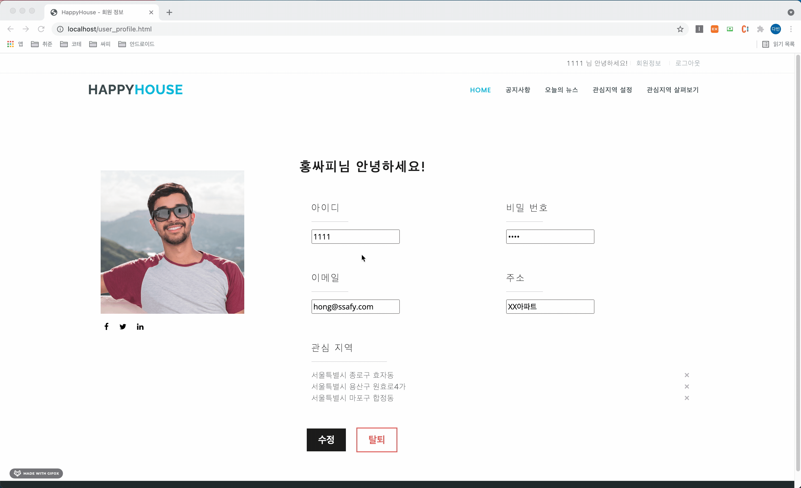

# SSAFY 5, 6차 Spring & Algorithm 관통 프로젝트 - Happy House 🏘

 

## 🤓 프로젝트 참여자

- 김다빈
- 하윤주

## 📌 목차

1. 프로젝트 소개
2. 활용 데이터 및 API 소개
3. 활용 BackEnd & FrontEnd 프레임워크 소개
4. 기능 및 페이지 소개
   - 아파트 실거래가 정보 동별 조회
   - 아파트 실거래가 아파트별 조회
   - 회원 가입
   - 로그인, 로그아웃
   - 회원 정보 조회 및 수정, 탈퇴
   - 관심지역 등록, 조회, 삭제
5. 추가 기능 구현

 

## 💡 1. 프로젝트 소개

Happy House는 서울시의 부동산 거래 정보를 한 눈에 확인할 수 있는 프로그램입니다. 아파트 및 주택의 세부 정보와 함께 거래 금액과 거래 종류를 확인할 수 있고, 또한 법정동과 아파트 명으로 특정 부동산 정보를 검색할 수도 있습니다. 검색 결과는 지도 상에서 확인할 수 있습니다. 회원 정보 기능을 추가하여 회원별 관심지역을 확인할 수 있습니다.

## 💡 2. 활용 데이터 및 API 소개

1. 활용 데이터

- 공공데이터 포털(https://www.data.go.kr) - 국토교통부\_아파트매매 실거래 상세 자료

웹 사이트 상에서 법정동을 입력하면 공공데이터 포털과 비동기 통신을 통해 2021년 10월 아파트매매 실거래 데이터를 받아옵니다. REST 방식으로 통신하고 XML형태의 데이터로 받아와 JSON 형태로 파싱합니다.

받은 실거래 데이터 중 핵심 정보를 리스트 형태로 출력하고, 각 아파트의 위치를 지도 상에 표현합니다.

1. 활용 API

- 카카오맵 API(https://apis.map.kakao.com/web/)

공공데이터 포털에서 받은 실거래 데이터 중 주택의 위치 좌표(위도, 경도)를 파싱하여 카카오맵에 마커로 표현합니다.

또한 실거래 데이터 리스트의 각 아파트를 선택하면 지도 상에서 상세 정보를 추가적으로 확인할 수 있습니다.

## 💡 3. 활용한 BackEnd & FrontEnd 프레임워크 소개

> BackEnd

- BackEnd는 Spring Boot 환경으로 구축하였습니다. Spring MVC 패턴을 이용하여 모델, 컨트롤러, 뷰의 각 기능 별 역할을 분리하였습니다.
- Front와 REST 방식으로 통신하여 데이터만을 전달합니다.
- MyBatis 프레임워크를 사용하여 객체와 SQL을 매핑합니다.
- Global Exception Advice를 통해 예외를 전역에서 처리합니다.

> FrontEnd

- 화면은 정적 리소스(HTML, CSS, JS(JQuery))만을 사용합니다.
- Back과 ajax 방식으로 비동기 통신하여 데이터를 받아옵니다.
- CSS는 Bootstrap 테마를 적용했습니다.
- 로그인 세션 관리를 위해 Session Storage를 이용해 사용자의 아이디만을 저장합니다.

## 💡 4. 기능 및 페이지 소개

### 메인 화면

### 아파트 실거래가 정보 동별 & 아파트별 조회

- 아파트 지역(시, 도, 구군, 동) 정보를 선택하면 해당 지역에 존재하는 아파트 정보를 보여줍니다.
- 아파트 지역(시, 도, 구군, 동) 정보를 선택하고 특정 아파트 명을 검색할 경우 특정 아파트 정보를 보여줍니다.
- 아파트 정보는 지도 상에 마커로 출력됩니다.
- 아파트 이름에 검색어가 포함된 모든 아파트 정보를 출력합니다.

 

 

- 지도 좌측에 리스트 형태로 아파트 이름, 건축 년도, 거래금액, 평수 등의 정보를 출력합니다.
- 리스트 항목에 마우스를 올리면 해당하는 아파트의 세부 정보가 지도 상에 말풍선으로 출력됩니다.

 

### 회원 가입

- 회원 정보를 입력하여 서버에 회원 정보를 등록할 수 있습니다.
- 회원 가입과 동시에 로그인 상태로 유지되는 자동 로그인이 지원됩니다.

 

### 로그인

- 사용자 아이디와 비밀번호를 입력하여 로그인할 수 있습니다.
- 로그인 정보인 사용자 아이디는 session storage에 저장됩니다.

 

### 로그아웃

- 사용자 기능을 모두 사용했다면 로그아웃을 통해 세션을 종료할 수 있습니다.

 

### 회원 정보 및 관심 지역 조회

- 로그인 상태라면 회원 정보 조회 탭을 눌러 회원 정보를 확인할 수 있습니다.
- 사용자 아이디, 이름, 비밀번호, 이메일, 주소를 확인할 수 있습니다.
- 로그인 상태의 사용자가 관심 지역을 등록하면 이를 저장하여 확인할 수 있습니다.
- 회원 정보 조회 페이지에서 회원 정보와 함께 회원이 등록한 관심 지역을 확인할 수 있습니다.

### 회원 정보 수정

- 회원 정보 조회 페이지에서 회원 정보를 변경할 수 있습니다.

 

### 회원 정보 삭제

- 회원 정보 조회 페이지에서 회원 정보를 삭제하고 탈퇴할 수 있습니다.
- 회원 탈퇴 시 서버에 저장된 회원 정보도 삭제됩니다.

 

### 관심 지역 설정

- 메인 화면에서 법정동을 선택하면 해당 지역을 관심 지역으로 설정할 수 있습니다.

 

### 관심 지역 삭제

- 회원 정보 조회 페이지에서 특정 관심 지역을 삭제할 수 있습니다.

 
